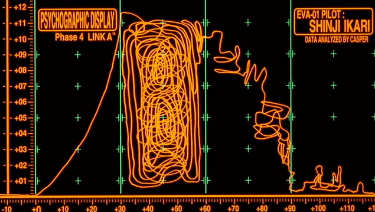

# Machine Learning

  

All of my curiousity about machine learning in one place.

Some projects will be finished, like `pkmn_stat_generator`,
many others will just have been experiments, and will be found
in `scratch-projects`.

### Coherent projects

These projects have a difinitive purpose and conclusion.

- `gpt/`: a basic transformer + attention from scratch.
  (from Karpathy's Neural Networks Zero-to-Hero)

- `pkmn_stat_generator/`: VAE network that studies pkmn stats and
  creates statistically viable generations.

### Unfinished Projects

Just for learning.

Everything from Computer Vison to small neural nets
that only add numbers.
